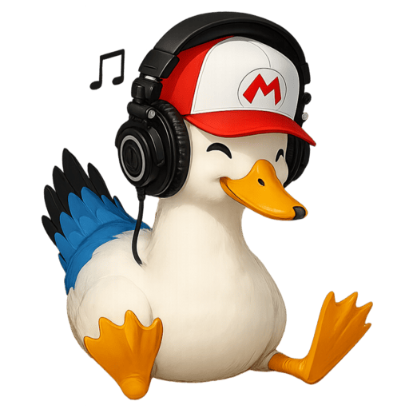

  

  # DuckysMusic

  **A modern, production-grade Discord music bot.**

  Lossless playback. 26 slash commands. 30 languages. 24/7 hosted by AIskaron Inc.

  

    
    
    
    
  

  

    <a href="https://discord.com/oauth2/authorize?client_id=1432026529805897758&permissions=37088320&scope=bot+applications.commands"><b>Add to your server</b></a>
    &nbsp;·&nbsp;
    <a href="https://bot.aiskaron.com"><b>Website</b></a>
    &nbsp;·&nbsp;
    <a href="https://dashboard.aiskaron.com"><b>Dashboard</b></a>
    &nbsp;·&nbsp;
    <a href="https://status.aiskaron.com">Status</a>
  

  

    <a href="docs/commands.md">Commands</a>
    &nbsp;·&nbsp;
    <a href="docs/faq.md">FAQ</a>
    &nbsp;·&nbsp;
    <a href="docs/permissions.md">Permissions</a>
    &nbsp;·&nbsp;
    <a href="SECURITY.md">Security</a>
  

---

## Table of contents

- [What it does](#what-it-does)
- [Slash commands at a glance](#slash-commands-at-a-glance)
- [30 languages](#30-languages)
- [Add the bot to your server](#add-the-bot-to-your-server)
- [Official links](#official-links)
- [Why a closed-source bot in 2026?](#why-a-closed-source-bot-in-2026)
- [Project status](#project-status)
- [Reporting issues](#reporting-issues)
- [Trademark and contact](#trademark-and-contact)

## What it does

<table>
  <tr>
    <td valign="top" width="33%" align="center">
       
      <b>Lossless playback</b> 
      Self-hosted Lavalink v4 node, Opus quality 10, HIGH resampling. Not a public node that disappears under load.
    </td>
    <td valign="top" width="33%" align="center">
       
      <b>Full queue control</b> 
      Skip, skipto, move, remove, shuffle, loop modes, history, paginated views. Survives a Docker restart.
    </td>
    <td valign="top" width="33%" align="center">
       
      <b>Voice handling</b> 
      Joins your channel, leaves cleanly when empty, reattaches after restarts within seconds.
    </td>
  </tr>
  <tr>
    <td valign="top" width="33%" align="center">
       
      <b>Interactive search</b> 
      <code>/search</code> picks across YouTube, SoundCloud, Bandcamp, Twitch, Vimeo and direct streams.
    </td>
    <td valign="top" width="33%" align="center">
       
      <b>DJ mode</b> 
      Reserve disruptive commands (stop, skip, shuffle, clear) to a configurable role with <code>/djrole</code>.
    </td>
    <td valign="top" width="33%" align="center">
       
      <b>24/7 uptime</b> 
      Container-level autoheal restarts the bot or the audio node within ~30 seconds of degradation.
    </td>
  </tr>
  <tr>
    <td valign="top" width="33%" align="center">
       
      <b>Multiple sources</b> 
      YouTube, SoundCloud, Bandcamp, Twitch, Vimeo, HTTP. Spotify / Deezer / Apple Music search via LavaSrc.
    </td>
    <td valign="top" width="33%" align="center">
       
      <b>Audio filters</b> 
      Equalizer, karaoke, timescale, tremolo, vibrato, distortion, rotation, channel-mix, low-pass.
    </td>
    <td valign="top" width="33%" align="center">
       
      <b>30 languages</b> 
      Auto-detect from Discord locale, override per server with <code>/language</code>.
    </td>
  </tr>
</table>

## Slash commands at a glance

| Group | Commands |
|---|---|
| **Playback** | `/play` · `/pause` · `/resume` · `/stop` · `/skip` · `/skipto` · `/seek` · `/replay` |
| **Queue** | `/queue` · `/nowplaying` · `/history` · `/volume` · `/loop` · `/shuffle` · `/move` · `/remove` · `/clearqueue` |
| **Voice** | `/join` · `/leave` |
| **Search** | `/search` |
| **Utility** | `/help` · `/ping` · `/uptime` · `/sources` |
| **Settings** | `/language` · `/djrole` |

Full reference with parameters and examples in [`docs/commands.md`](docs/commands.md).

## 30 languages

Arabic · Bulgarian · Czech · Danish · Dutch · English · Filipino · Finnish · French · German · Greek · Hindi · Hungarian · Indonesian · Italian · Japanese · Korean · Norwegian · Polish · Portuguese (Brazil) · Romanian · Russian · Simplified Chinese · Spanish · Swedish · Thai · Traditional Chinese · Turkish · Ukrainian · Vietnamese.

The bot picks an initial language from the user's Discord client locale and falls back to English when a key is missing. Override per server with `/language <code>`. Full ISO-code table in [`docs/commands.md#language-support`](docs/commands.md#language-support).

## Add the bot to your server

> ### [Add DuckysMusic](https://discord.com/oauth2/authorize?client_id=1432026529805897758&permissions=37088320&scope=bot+applications.commands)
>
> Required scopes: `bot` + `applications.commands`. You need **Manage Server** in the target Discord server.

Once added, type `/help` in any channel where the bot is present. Type `/language <code>` to switch the bot's language for that server.

## Official links

| | URL | Purpose |
|---|---|---|
| **Website** | [bot.aiskaron.com](https://bot.aiskaron.com) | Product overview, features, FAQ. |
| **Dashboard** | [dashboard.aiskaron.com](https://dashboard.aiskaron.com) | Configure DJ role, default volume, language and other per-server settings via OAuth login. |
| **Status** | [status.aiskaron.com](https://status.aiskaron.com) | Live uptime for the bot and the audio node. |
| **Invite** | [Add to your server](https://discord.com/oauth2/authorize?client_id=1432026529805897758&permissions=37088320&scope=bot+applications.commands) | Discord OAuth invite link. |

> The bot is **free**. There is no paid tier and no upsell.

## Why a closed-source bot in 2026?

DuckysMusic is an internal AIskaron Inc. product. The source is not published because:

- The audio integration, anti-abuse heuristics, queue persistence, and admin web panel are part of an evolving production system, not a teaching example.
- Public release would invite trivial forks that strip rate limits, Discord ToS guardrails, and operational hardening.
- Operational telemetry, bug-fix patterns, and incident runbooks are operator confidential.

If you want to **use** the bot, the invite link is enough; you do not need the source. If you want to **learn how to build a Discord music bot**, the technology stack is well documented elsewhere: [discord.py](https://discordpy.readthedocs.io/) + [Lavalink v4](https://lavalink.dev/) + [Wavelink](https://wavelink.dev/).

## Project status

- **Version:** 5.3.x (semver, tracked in [`CHANGELOG.md`](CHANGELOG.md)). The version on a given day is the number printed by `/uptime`.
- **Hosting:** AIskaron Inc. infrastructure, 24/7 with supervised restart and container-level autoheal.
- **Telemetry:** the bot exposes an internal health endpoint and a private admin panel; no user-content telemetry leaves the host.
- **Privacy:** per-guild settings (DJ role, language, default volume) and per-user opt-out flags only. Music is streamed, never stored. Data export and deletion requests go to **privacy@aiskaron.com** (GDPR Article 12, 30-day response window). Full policy in [`docs/faq.md`](docs/faq.md).

## Reporting issues

Use the GitHub issue tracker for **behavioural** bugs you observe in your own server. For security issues, follow [`SECURITY.md`](SECURITY.md). Code-level questions, internal architecture questions, and feature internals will be closed; this repository is a showcase, not the source.

## Trademark and contact

The DuckysMusic name, logo, and the documentation in this repository are © 2024–2026 AIskaron Inc., all rights reserved. See [`LICENSE`](LICENSE) and [`assets/README.md`](assets/README.md).

Contact:

- **General**: hello@aiskaron.com
- **Security**: security@aiskaron.com
- **Privacy / GDPR**: privacy@aiskaron.com

---

  Built by <a href="https://aiskaron.com"><b>AIskaron Inc.</b></a>

